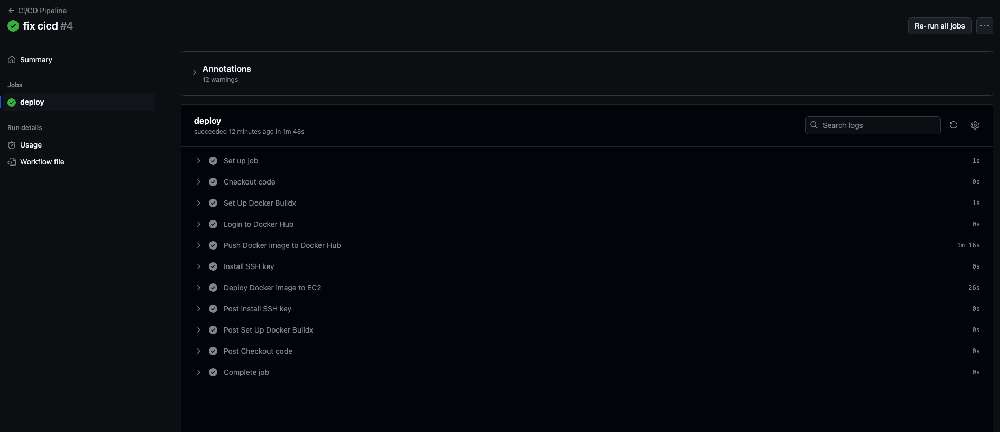

# Github Resume Generator
This repository contains a React application that generates a dynamic resume based on a user's GitHub profile. It fetches user data, repositories, and languages used, displaying them in a clean, resume-like format. The application is built with Create React App, utilizes Docker for containerization, and is deployed to AWS S3 for static website hosting.

### Deployed link 
- AWS s3 deployed version: 
 - Home: http://www.my.githubresumebuilder.cloud.s3-website-us-east-1.amazonaws.com
 - Resume page: http://www.my.githubresumebuilder.cloud.s3-website-us-east-1.amazonaws.com/mcollina

### Steps to run application 

- Dev: 
```bash
npm run dev
```

- Run localy nginx webserver wich servers application as static
```bash
docker compose up -d
```

- Build production version
```bash
npm run build
```

### CICD configuration 
Application will be automatically deployed to AWS EC2 instances on every push to "master" branch. 
The CI/CD pipeline is set up using GitHub Actions and includes the following steps:
1. Build and Push Docker Image:
    - The pipeline builds a Docker image containing the React application served by NGINX.
    - It pushes the image to Docker Hub with both a versioned tag and the latest tag.
2. Deploy to EC2:
    - Using SSH, the pipeline connects to the EC2 instance, pulls the latest Docker image from Docker Hub, and runs it on the server.
    - Any previously running container is stopped and removed to ensure a smooth update.

AWS Configuration Requirements
To ensure successful deployments, you need to configure the following on the AWS side:

1. EC2 Instance: An EC2 instance running Ubuntu, with Docker installed and configured.
2. SSH Access:
    - The .pem key generated during EC2 instance creation should be added as a secret in GitHub to enable SSH access.
    - Security groups should allow inbound SSH (port 22) and HTTP (port 80) traffic.
3. Environment Variables: Define necessary GitHub Secrets for Docker Hub credentials, EC2 access, and any application-specific environment variables (e.g., API URLs or tokens) used during the Docker build process.

This setup allows the pipeline to securely build, push, and deploy application updates to the EC2 instance automatically, streamlining continuous deployment.

Example of CI/CD pipeline deploy workflow result: 



